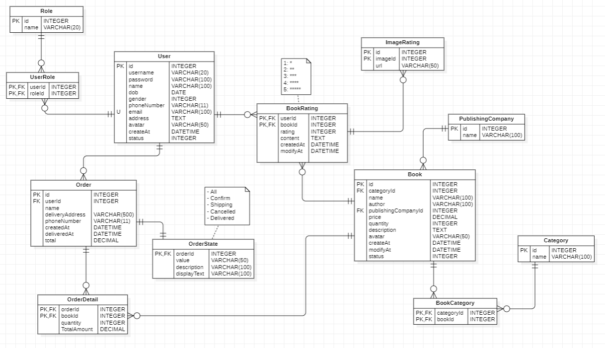

# book-store
**1. ERD Diagram**


**2. Create Mysql database**
```bash
create database bookstore
```

**3. Change mysql username and password**
- open file ```src/main/resources/application.properties```
- change `spring.datasource.username` and `spring.datasource.password` your mysql

**4. APIs (http://localhost:8080/api)**
## Explore Rest APIs

### USER
| Method | Url | Description | Sample Valid Request Body |
|--------|-----|-------------|---------------------------|
|GET|/users|get all user||
|GET|/users/{id}|get user by id||
|GET|/users|search user|[JSON](#userSearch)|
|POST|/users|create user|[JSON](#userCreate)|
|PUT|/users/{id}|update user|[JSON](#userUpdate)|
|DELETE|/users/{id}|delete user||

### LOGIN
| Method | Url | Description | Sample Valid Request Body |
|--------|-----|-------------|---------------------------|
|POST|/login||[JSON](#login) |

### CATEGORY
| Method | Url | Description | Sample Valid Request Body |
|--------|-----|-------------|---------------------------|
|GET|/categories|get all category||
|POST|/categories|create new category|[JSON](#categoryCreate)|
|PUT|/categories/{id}|update category|[JSON](#categoryUpdate)|
|DELETE|/categories/{id}|delete category||

### BOOK
| Method | Url | Description | Sample Valid Request Body |
|--------|-----|-------------|---------------------------|
|GET|/books|get all book||
|GET|/books/{id}|get book by id||
|GET|/books/{id}/books|get book by category||
|POST|/books|create book|[JSON](#bookCreate)|
|PUT|/books/{id}|update book|[JSON](#bookUpdate)|
|DELETE|/books/{id}|delete book||

## Sample Valid JSON Request Bodys

##### <a id="userSearch">Search User -> /users</a>
```json
{
  "search": "name of user"
}
```

##### <a id="userCreate">Create User -> /users</a>
```json
{
    "username": "thienphuoc",
    "password": "123456",
    "name": "Hồ Thiện Phước",
    "dob": "2001-03-22",
    "gender": "nam",
    "phoneNumber": "0123456789",
    "email": "thienphuoc2391@gmail.com",
    "address": "Tam Phước, Phú Ninh, Quảng Nam",
    "avatar": ""
}
```

##### <a id="userUpdate">Update User -> /users/{id}</a>
```json
{
    "username": "thienphuoc",
    "password": "123456",
    "name": "thiện phước",
    "dob": "2001-09-30",
    "gender": "nam",
    "phoneNumber": "0123456789",
    "email": "thienphuoc@gmail.com",
    "address": "Tam Phước, Phú Ninh, Quảng Nam",
    "avatar": ""
}
```

##### <a id="login">Log In -> /login</a>
```json
{
	"username": "thienphuoc",
	"password": "123456"
}
```

##### <a id="categoryCreate">Create Category -> /categories</a>
```json
{
	"name": "name category",
}
```

##### <a id="categoryUpdate">Update Category -> /categories/{id}</a>
```json
{
	"name": "name category",
}
```

##### <a id="bookCreate">Create book -> /books</a>
```json
{
    "avatar": "",
    "name": "",
    "categories":[
        "Chính trị - Pháp luật",
        "Khoa học công nghệ - Kinh tế"
    ],
    "authors": [
        "Nguyễn Nhật Ánh"
    ]
    
}
```

##### <a id="bookUpdate">Update book -> /books/{id}</a>
```json
{
    "avatar": "",
    "name": "",
    "categories":[
        "Chính trị - Pháp luật",
        "Khoa học công nghệ - Kinh tế"
    ],
    "authors": [
        "Nguyễn Nhật Ánh"
    ]
    
}
```
